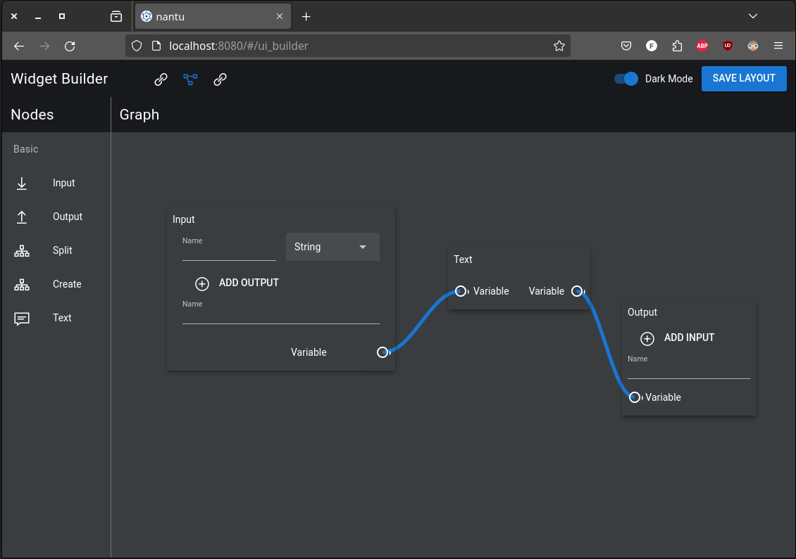
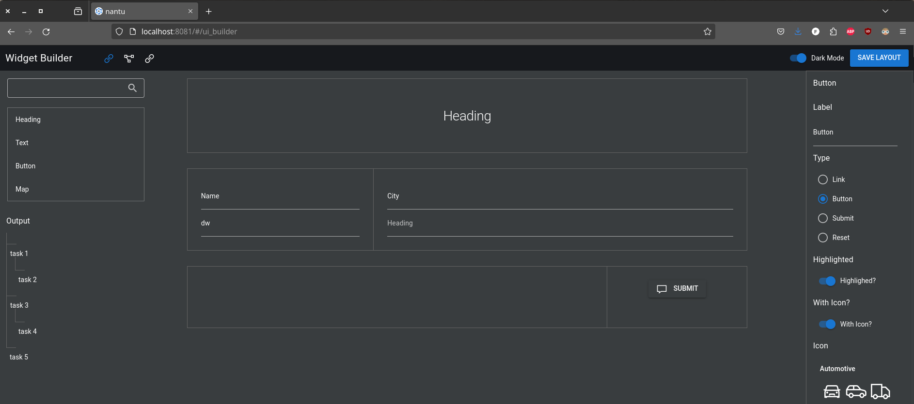

  <h1>Unnamed Data Platform</h1>

  

    <strong>Backend = Rust / Frontend = Vue3</strong>
  

  
  
    
    
    
  

# Vision

- Tool to create workflows for processing large amounts of data remotely in the cloud.
- Easy to use and visual appealing
- Fast and secure on the backend

# Technologies

## Backend

- Rust (2018 Edition)
- Rocket (>= 0.5) as server
- Diesel (>= 2.0) as ORM layer
- Postgres

## Frontend

- Vue3 (most of the code is still written for Vue2 but is integrated bit by bit to Vue3)

## DevOps / Environment

- Docker
- K8s
- Skaffold

# Status

Development is ongoing but very slowly as it is currently maintained only by one developer with limited time available. Don't expect a release in the near future.

It currently contains only one service with rudimentary frontend serving as a base for further development.

# Impressions

Following are screenshots of the editors to create the input / output pages for a data processing.

The logic editor to link elements together. Linked elements react on changes on each other.
In the following example the "Text" block represents a text input field that shows the value
from the "Input" block to the user. If the user changes the value within the "Text" block the updated value is then available to the "Output" block.

The UI builder where the user can create custome forms and pages. The single elements are logically linked together by the "logic editor" (see screenshot above).

